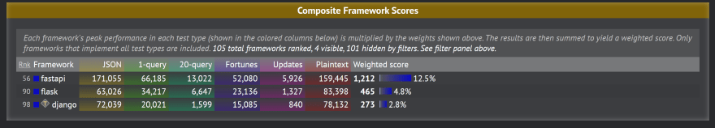

#  FastAPI 개요

### * 마이크로프레임워크(Microframework)란
- 핵심적인 기능만을 가지고 있는 작고 강력한 웹 애플리케이션 프레임워크
- 풀 스택 프레임워크와 대조되는 개념
- 화면을 그리는 것보다는 Web API를 제공하는 데 더 집중한 프레임워크
- SPA(Single Page Application) 등에서 호출하거나, Web API나 Batch에서 호출하여 처리하는 것이 특기
- Docker를 이용하면 독립적인 환경에서 FastAPI를 동작시킬 수 있고, 그 환경을 그대로 프로덕션 환경인 클라우드 플랫폼에 배포할 수 있다.
```
- 요청(request) 및 응답(response) 스키마 정의에 따라 Swagger UI 문서를 자동으로 생성
- 위 스키마를 명시적으로 정의함으로써 타입 안전(type safety) 개발이 가능
- ASGI(Asynchronous Server Gateway Interface)를 지원하므로 비동기 처리가 가능해 속도가 빠름

* ASGI란?
: 파이썬에서 비동기 웹 애플리케이션을 위한 표준 인터페이스
  비동기적인 웹 서버와 애플리케이션을 연결하여 빠르고 실시간으로 작동하는 서비스를 구현할 수 있도록 도와줌
  이벤트 기반 처리를 지원하여 WebSocket과 같은 기술을 사용할 수 있게 해줌
  Django와 FastAPI와 같은 프레임워크에서 비동기 처리를 가능하게 함
```

- 머신러닝의 처리 중에 API로 구축되는 경우가 많은 추론(inference)단계에서 비교적 시간과 부하가 많이 걸리는 처리가 많이 발생하는데, 이러한 경우 비동기 처리를 통한 빠른 속도를 활용할 수 있다.
- 스키마를 먼저 정의하고 프론트엔드와 백엔드 간의 인터페이스를 정해, 각각의 개발을 동시에 시작하는 방식을 스키마 기반 개발(Schema-Driven Development, SDD)이라고 한다.
```
* 스키마 기반 개발이란?
: 개발전에 미리 공통적인 스키마라는 데이터 구조를 정의하는 개발 방법론
  이는 데이터의 형식, 필수/선택적인 요소, 제약 조건 등을 명확히 정의하여 데이터의 일관성과 유효성을 보장
  스키마 기반 개발을 이용하면 프론트엔드와 백엔드를 통합할 때, 설계 오류 등으로 발생하는 리스크를 줄일 수 있고, 개발 속도를 높일 수 있다.
```
- FastAPI는 Go와 같은 정적 타입(Static Typed) 언어와 비교해도 뒤지지 않는 성능을 지니고 있어, 서비스과 확대되는 시기에도 충분히 부하를 견딜 수 있는 API를 만들 수 있다.

### * Flask와 비교
- Flask는 2010년부터 개발되고 있는 파이썬 경량 웹 프레임워크
- Flask는 간단하게 API를 만드는 데 매우 유용한 프레임워크
```
* Flask에는 없는 Fast API 특징
: 자동으로 Swagger UI 문서를 생성함
  타입 안전
  속도가 빠름
```
- FastAPI vs Flask 벤치마크 결과
