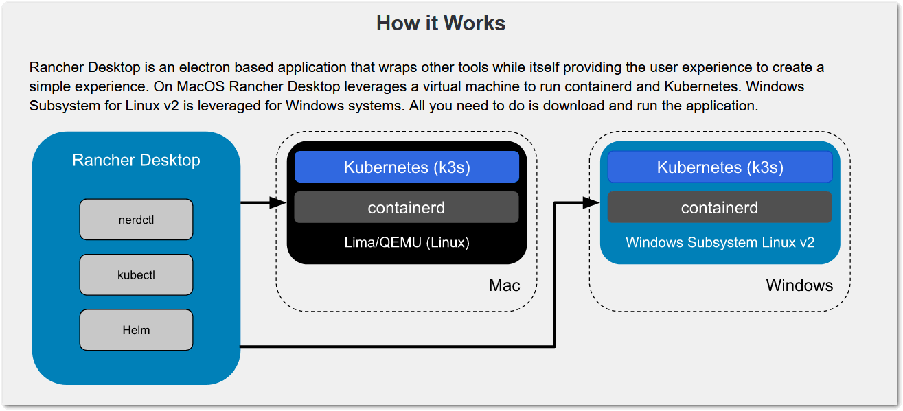

# Docker 환경 설치
### * docker compose를 사용하는 이유
- Docker는 컨테이너(container)서비스를 제공하는 애플리케이션
```
컨테이너란?
: 애플리케이션 코드와 필요한 라이브러리, 종속 항목 등을 패키징하여 어디서나 실행 가능하도록 만든 소프트웨어 실행 단위
  실행에 필요한 모든 파일을 포함하며, 격리된 실행 환경에서 애플리케이션을 실행하는 기술로, 개발, 테스트, 프로덕션 등 다양한 환경에서 쉽게 이동할 수 있도록 해줌
```
- docker compose는 Docker가 제공하는 제품 중 하나
- 여러개의 컨테이너를 한꺼번에 다룰 수 있게 해주는 도구
- docker compose 명령을 실행하여 이용
```
Docker 내에 설치하는 이유는?
- 환경의 차이를 없애기 위해
- 환경을 제한하기 위해
```
- 환경에 따라 파이썬의 버전이 다르거나, 파이썬의 패키지 라이브러리가 운영체제(OS)에 의존하는 경우가 있음
- 파이썬은 같은 운영체제 내에 여러 버전을 설치하고, 이를 바꿔가며 사용할 수 있음
```
버전을 전환하는 방법?
: pyenv, virtualenv(venv), Pipenv 등
```
- 하지만, 이 방법들은 표준이 정립된 상태라고 할 수 없음
- Docker를 이용하면 파이썬이 실행되는 운영체제와 이번에 작성할 API보다 하위 레이어의 시스템을 고정할 수 있으므로, 환경에 따른 차이를 줄일 수 있다.
- My SQL과 같은 낮은 데이터베이스는 더 낮은 레이어의 API를 이용하여 구축되는 경우가 많아서 파이썬 실행 환경보다도 운영체제나 하드웨어에 더 의존하는 경향이다.
- 여기서도 환경의 차이를 흡수하는 Docekr가 힘을 발휘한다. 또한, 파이썬 실행 컨테이너와 MySQL 컨테이너를 분리함으로써 컨테이너 간의 의존 관계 명확히 할 수 있다.
- Docker는 사용하면 파이썬과 데이터베이스 환경을 컨테이너 안에 가둬 둘 수 있으므로 문제가 발생했을 때 간단히 컨테이너를 다시 만들거나 폐기할 수 있어서, 결과적으로 호스트 머신의 환경을 오염시키지 않는다.

### * Docker 설치
- Docker Desktop을 포함하지 않는 CLI로서의 docker(DOcker 클라이언트)와 dockerd(Docker 데몬)는 계속 무료로 사용할 수 있으므로, 이들이 동작하는 백엔드 환경만 준비하면 docker compose를 이용할 수 있다.
- Docker를 무료로 이용하고 싶다면, Docker Desktop의 대안으로 Rancher Desktop을 이용하는 방법도 있다.
```
Rancher Desktop은?
: 원래 컨테이너를 관리하는 Kubernetes를 로컬 머신에서 쉽게 사용할 수 있게 하는 GUI 애플리케이션
Kubernetes는?
: 컨테이너화 된 애플리케이션을 효율적으로 관리하는 오픈 소스 플랫폼으로 컨테이너의 자동 배포, 확장 등을 수행하여 여러 클러스터 간의 애플리케이션 운영을 효율적으로 지원하고, 도커를 비롯한 다양한 컨테이너 관련 도구들과 함께 사용해서 애플리케이션 관리를 간소화)
```
- Rancher Desktop은 내부적으로 맥의 경우 Lima, 윈도우의 경우 WSL2(Windows Subsystem for Linux v2)를 이용해 가상으로 리눅스 환경을 구현하여, 그 위에서 Docker 컨테이너를 실행할 수 있다.
```
WSL이란?
: 리눅스를 윈도우의 하위 시스템으로 이용하는 기술
  이를 통해 기존 가상 머신의 부담이나 듀얼 부팅 설정 없이도 GNU/리눅스 환경에 속하는 대다수의 명령줄 도구, 유틸리티, 애플리케이션을 윈도우에서 직접 실행할 수 있다.
```
- Rancher Desktop은 아파치라이선스(Apache License)의 오픈 소스 소프트웨어이므로 무료로 이용할 수 있다.
```
아파치 라이선스는?
: 아파치 소프트웨어 재단에서 개발한 소프트웨어에 대한 라이선스 규정을 나타냄
  특히, 아파치 라이선스 2.0 기준으로, 해당 라이선스는 아파치 소프트웨어 재단에서 생성된 소프트웨어를 기반으로 하는 프로그램을 누구나 자유롭게 제작할 수 있도록 허용
  더불어, 해당 소프트웨어의 파생물에 대한 권리를 보유한 개인이나 단체는 그 파생물을 자유롭게 사용, 수정, 배포할 수 있는 자유를 부여함
```

- Mac OS의 경우 Lima에서 Docker가 동작하며, 윈도우의 경우 WSL2에서 Docker가 동작

### * 윈도우의 경우 주의사항
- 윈도우에서 텍스트 파일 줄 바꿈 코드로 CRLF(\r\n)를 사용하는 것이 일반적
- 반면에 맥이나 리눅스에서는 LF(\n)이 일반적
- 여기서 Docker image는 모두 리눅스 운영체제를 기반으로 하고 있어, 파일 생성 전에 기본적으로 에디터의 줄 바꿈 코드를 LF로 미리 설정해 놓는 것을 권장
- Git의 설정에 따라 checkout이나 commit을 할 때 줄 바꿈 코드를 자동으로 윈도우용 CRLF로 변환하는 기능이 활성화 되어 있는 경우 아래 명령어로 해당 기능을 비활성화 하는 걸 추천
```
> git config --global core.autocrlf false
```
- Docker Desktop과 Rancher Desktop 모두 해당되지만, 윈도우의 Docker는 WSL2의 가상 머신에서 동작한다.(Docker Desktop에서는 WSL Integration이 활성화된 경우)
- WSL2는 가상 머신의 메모리를 동적으로 할당하지만, 설정에 따라 호스트 머신보다 가상 머신에 지나치게 많은 메모리를 할당하는 경우가 있다.
- 그 결과, 가상 머신의 메모리 사용량에 따라 호스트 머신이 무거워질 수 있는데 가상 머신이 사용할 수 있는 메모리의 상한을 설정해 해결할 수 있다.
```
C:\Users\{사용자 이름}\.wslconfig 라는 파일을 생성 (파일 내용은 하기와 같음)

[wsl2]
memory = 2GB
```