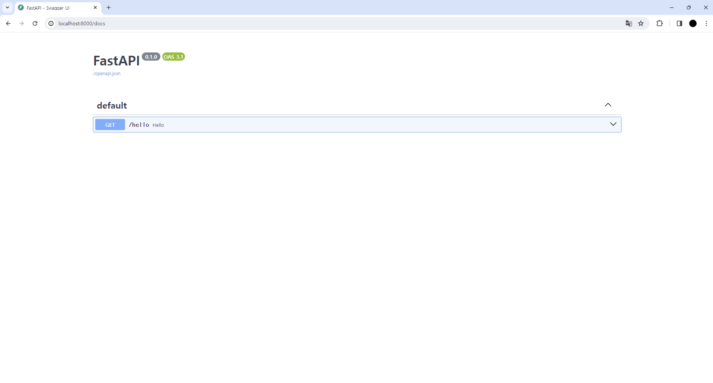
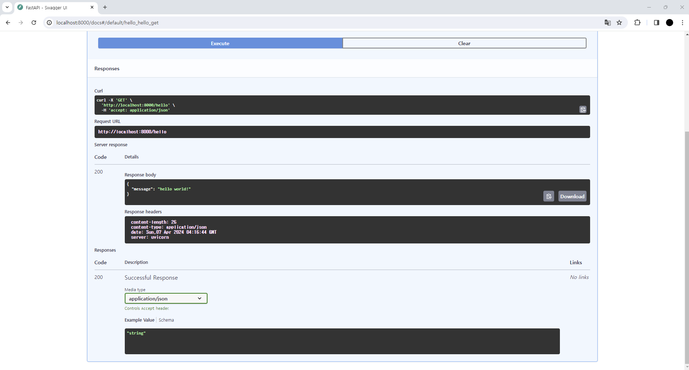
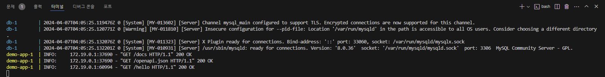

### * Hello World! 표시를 위한 파일 작성
- 앞에서 설치한 환경에서 FastAPI를 실행해보기
- 프로젝트 디렉터리 바로 아래에 API 디렉터리를 생성하고 하기 파일을 추가한다.
```
from fastapi import FastAPI

app = FastAPI()

@app.get("/hello")
async def hello()
    return {"message" : "hello world!"}
```
- __ init__.py는 이 api 디렉터리가 파이썬 모듈임을 나타내는 빈 파일
- main.py에는 FastAPI의 코드를 작성
- 아래와 같은 오류가 나타난다면 Rancher Desktop을 실행한 뒤 정상적으로 docker가 로드된 뒤에 다시 명령을 실행
```
error during connect: this error may indicate that the docker daemon is no running: Get "http://..." open //./pipe/docker_engine: The system cannot find the file spectified.
```
- 그러면 포그라운드(foreground)에서 서버가 실행된 상태가 됨
```
포그라운드란?
: 사용자가 직접적으로 상호작용하는 프로세스나 작업을 가리킨다.
  사용자가 특정 작업을 실행하고, 그 진행 상황을 실시간으로 확인하며 필요한 경우 입력을 할 수 있는 상태이다.
```
- 이 상태에서 브라우저에서 아래 URL에 접속해보자
```
$ docker compose up
```
- 위 명령어를 실행하여 API를 실행한다.
```
http://localhost:8000/docs
```

- Get /hello라는 엔드포인트(endpoint)가 나타남
```
엔드포인트란?
: API에서 요청을 받아들이고, 그에 따른 응답을 반환하는 디지털 위치 혹은 지점을 가리킨다.
  간단히 말해 API를 호출할 때 그 호출이 도착하는 목적이이다.
  엔드포인트는 일종의 URL로 표현되며, 이 URL을 통해 API 클라이언트가 API 서버에 접근하고 특정한 작업을 수행하거나 데이터를 가져올 수 있다.
```
- 엔드포인트가 나타나면 서버가 성공적으로 구동되었음을 알 수 있다.
- 기본적으로 알겠지만, 위 화면을 Swagger UI라고 한다.
```
Swagger Ui는
: API 사양을 알려주는 문서로, REST API를 표현하는 OpenAPI라는 형식으로 정의되어 있다.
  사용자는 Swagger UI를 통해 API의 엔드포인트 목록을 확인하고, 각각의 엔드포인트에 대한 세부 정보를 시각적으로 살펴볼 수 있다.
  '문서'라고 하지만, 사실 이 UI는 단순한 정적인 문서 파일이 아니라 실제로 API의 동작을 검증할 수 있는 편리한 도구(상포작용형 문서)이다.
```

- Get /hello에서 Execute한 결과, Responses에 실행된 파라미터와 그에 대한 응답(response)을 확인할 수 있다.
```
{
  "message" : "hello world!"
}
```
- 응답을 보면 알 수 있듯이 기본적으로 응답은 JSON 형식으로 반환된다.
- 이 외에도 FastAPI는 HTMLResponse, FileResponse 등 다양한 응답 형식을 지원
```
이것은 Request URL에 표시된 바와 같이 실제로는, [URL]http://localhost:8000/hello 의 API를 호출했을 때 얻은 응답이다.
그 증거로 docker compose up을 실행한 창을 보면 API 요청이 로그에 표시되어 있다.
```

- FastAPI 서번는 포그라운드에서 동작하고 있는 상태이며, 필요에 따라 Ctrl + C 명령으로 멈출 수 있다,

### * 코드의 의미
```
app = FastAPI()
```
- app은 FastAPI의 인스턴스이다.
- main.py에는 if __ name__ == "__ main__": 이라는 문구가 없지만, 실제로는 uvicorn이라는 ASGI 서버를 통해 이 파일의 app 인스턴스가 참조된다.
```
@app.get("/hello")
```
- @로 시작하는 이 부분을 파이썬에서는 데코레이터라고 한다.
- 자바의 애너테이션이나 C#의 속성(Attribute)과 비슷한 형식이지만, 파이썬의 데코레이터는 함수를 변형하고, 함수에 새로운 기능을 추가한다.
```
FastAPI 인스턴스에 대해서 데코레이터로 수정된 함수를 FastAPI에서는 경로 동작 함수(path operation function)라고 부른다.
```
- 경로 동작 함수를 구성하는 데코레이터는 하기 두 부분으로 나뉜다.
```
- 경로(path)
- 동작(operation)
```
- '경로'는 "/hello" 부분을 가리킴
- 앞서 언급했듯이 이 API는 다음과 같은 엔드포인트를 가지고 있다.
```
[URL] http://localhost:8000/hello
```
- 이 /hello 엔드포인트를 '경로'라고 부른다.
- '오퍼레이션'은 get 부분을 말한다.
  - REST HTTP 메서드 부분으로, GET / POST / PUT / DELETE로 대표되는 HTTP 메서드를 정의한다.
- def 앞에는 async가 붙어 있는데, 이는 비동기임을 알려주는 접근 제어자(Access Modifier)이다.
```
접근 제어자란?
: 클래스의 멤버(변수, 메서드 등)에 대한 접근 권한을 제어하는데 사용되는 키워드이다.
  이를 통해 정보은닉의 개념을 실현하고, 클래스 외부에서의 직접적인 접근을 제어할 수 있다.
```