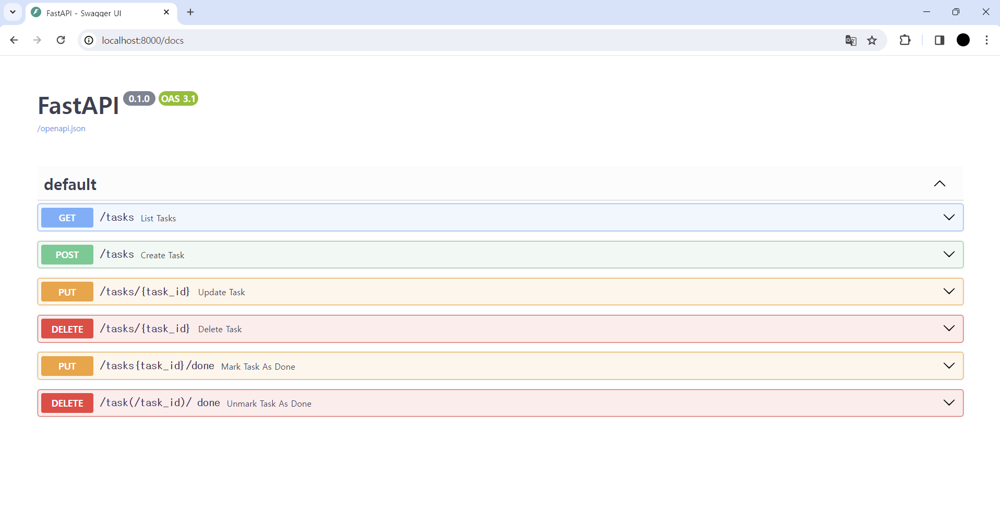
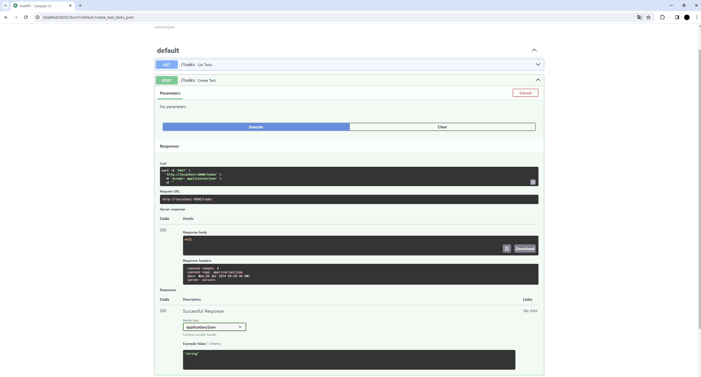

### * 경로 동작 함수에 대해
- 라우터에는 경로 동작 함수(path operation function)를 정의한다.
- 경로 동작 함수는 경로(path)와 동작(operation)의 조합으로 정의된다고 앞서 설명했다.
- 앞에서 설명한 REST API의 엔드포인트와 HTTP 메서드에 각각 대응된다.
- ToDo 앱을 만들기 위해 라우터에 하기와 같은 6가지 경로 동작 함수를 정의하게 된다.
```
- GET /task
- POST /task
- PUT / tasks/{task_id}
- DELETE /task/{task_id}
- PUT /task/{task_id}/done
- DELETE /tasks/{task_id}/done
```

### * 경로 동작 함수 만들기
- 6개의 함수를 하나의 파일에 담게 되면, 구현 상태에 따라서는 파일 크기가 커져 보기 좋지 않을 수 있다.
- 함수에 기능을 추가할 때마다 파일 크기가 커지므로 미리 명확하게 분할해 놓아야 더욱 실용적인 설계가 될 수 있다.
- 분할은 리소스 단위로 하는 것을 추천한다.
- 이번 ToDo 앱의 경우 크게 /task와/tasks/{task_id}/done 두 개의 리소스로 나눌 수 있으므로 각각 api/routers/task.py와 api/routers/done.py에 작성한다.
```
# api/main.py

from fastapi import APIRouter


router = APIRouter()


@router.put("/tasks{task_id}/done")
async def mark_task_as_done():
  pass


@router.delete("/yask(/task_id)/ done")
async def unmark_task_as_done():
  pass
```
```
# api/routers/done.py

from fastapi import APIRouter


router = APIRouter()


@router.put("/tasks{task_id}/done")
async def mark_task_as_done():
  pass


@router.delete("/task(/task_id)/ done")
async def unmark_task_as_done():
  pass
```
```
# apit-/main.py

from fastapi import FastAPI


from api.routers import task, done

app = FastAPI()
app.include_router(task.router)
app.include_router(done.router)
```
- 이것으로 routers의 플레이스 홀더(Placeholder) 준비는 끝났다.
```
플레이스 홀더란?
: 문자나 이미지 등의 요소가 들어갈 자리를 임시로 채워넣은 내용물으 말한다.
  하지만 Swagger UI에 나타나지 않는다.
  하지만 이것만으로는 앞서 설명한 swagger UI에 나타나지 않는다.
  - 위의 두 파일로 작성한 router 인스턴스를 FastAPI 인스턴스로 가져와야 한다.
  - Hello World!를 작성한 api/main.py을 다시 작성한다.
```

### * 동작 확인
- 지금까지 작업을 통해 Swagger UI에 6개의 경로 동작 함수에 해당하는 엔드포인트가 추가되었다.

- Docker에 FastAPI 환경을 구축할 때 변경 사항을 즉시 반영하는 핫 리로드(hot reload) 옵션(--reload)을 추가했으므로, 파일을 저장하면 Swagger UI를 열었을 때 위와 같이 최신 상태가 반영되어 있을 것이다. (환경에 따라 다시 로드되기까지 최대 20초 정도 걸릴 수 있다.)
- async def list_tasks()는 Swagger UI에서는 List Tasks라는 설명을 덧붙여 표시된다.
- 이는 함수명을 바탕으로 자동 생성된 설명이다.
- Swagger UI를 풍부하고 이해하기 쉬운 문서로 만들기 위해, 가능한 한 이해하기 쉽고 본문을 잘 표현하는 함수 이름을 붙이는 걸 추천한다.
- 여기까지 구현은 단지 플레이스홀더를 준비한 것에 불과하다.
- 결과를 확인하기 위해 POST/tasks의 경로 동작을 보자

- Try it out을 클릭한 뒤 Execute 버튼을 클릭하면 Response body에는 null만 반환되는 것을 확인할 수 있다.
- 다음 챕터에서 스키마(scheme)를 사용해 정형화된 값을 채워 응답을 반환하도록 정의해 보자.