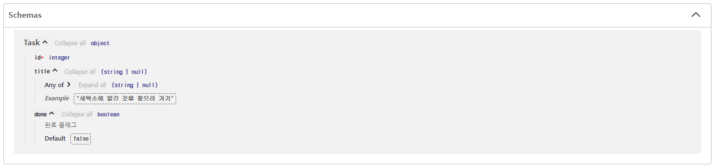

### * 타입 힌트
- 파이썬은 동적 타입 언어(Dynamic Typed Language)
```
동적 타입 언어란?
: 프로그램이 실행될 때 변수의 데이터 타입을 명시적으로 선언하는 것이 아니라, 변수에 할당되는 값에 따라 데이터 타입이 동적으로 결정되는 언어를 말한다.
```
- 최근에는 동적 타입 언어인 파이썬에서도 타입 힌트 기능이 도입되었다.
- 타입 힌트를 사용하면, 코드를 작성하는 시점에서는 아직까지 동적으로 타입이 결정되지만, 코드 내에 명시된 타입 힌트를 통해 함수의 시그니처(signature)를 더 명확하게 나타낼 수 있다.
```
함수의 시그니처는
: 해당 함수를 유일하게 식별할 수 있는 정보를 담고 있는 개념이다.
  주로 함수의 이름과 파라미터 개수, 타입, 반환 값의 타입을 포함한다.
```
- 함수 시그니처는 함수를 호출할 때 필요한 정보를 제공하며, 이를 통해 컴파일러나 인터프리터가 올바른 함수를 찾아 실행할 수 있다.
- 보통 타입 힌트는 실행 시(runtime)에는 영향을 주지 않고(코드의 내용에는 아무런 영향을 주지 않고), IDE 등에 타입 정보를 제공하는 역할을 한다.
- 하지만 FastAPI가 의존하는 Pydantic이라는 강력한 라이브러리를 통해 타입 힌트를 적극적으로 활용하여 API 입출력의 유효성 검사를 수행한다.
```
Pydantic이란?
: 파이썬에서 데이터 모델을 정의하고, 데이터 유효성을 검사하는 라이브러리
  데이터의 형식을 정하고 이를 확인하여 안정성을 높이며, 사용자가 이해하기 쉬운 오류 메시지를 제공하여 문제를 해결하는 데 도움을 준다.
```
- 실행시 영향을 미치지 않는다는 것은 무엇을 의미하나?
```
에를 들어 int 타입일 것으로 예상하고 변수 num을 다음과 같이 정의했다고 하자

>>> num: int = 1

그런데 여기서 실수로 문자열 타입인 string을 대입하려고 한다.

>>> num = "string"

파이썬은 오류를 발생시키지 않는다.
처음에 제시한 : int는 타입 힌트일 뿐, 정적 타입 언어(Statically Typed Language)처럼 변수의 타입을 제한하는 것은 아니다.


* 정적타입 언어란?
: 프로그램을 컴파일할 때 변수의 타입을 결정하고 이를 명시적으로 선언해야 하는 언어를 의미

아래와 같은 결과를 보면 변수의 타입이 str인 것을 알 수 있다.

>>> num
'string'
>>> type(num)
<class 'str>'
```

### * 응답 타입 정의
- 앞서 설명한 경로 동작 함수에 응답 타입을 정의하자
```
: api/schemas/task.py

from pydantic import BaseModel, Field

class Task(BaseModel):
  id: int
  title: str | None = Field(None, example = "세탁소에 맡긴 것을 찾으러 가기")
  done: bool = Field(False, description = "완료 플래그")
```
- 이 파일은 FastAPI의 스키마를 나타낸다.
- API의 스키마는 API 요청과 응답의 타입을 정의하기 위한 것으로 데이터베이스의 스키마와 다르다는 점을 주의해야 한다.
- 이 스키마를 이용하여 실제로 API 응답을 반환할 수 있는지 확인해보자
- 앞서 작성한 api/routes/task.py의 list_tasks() 함수를 아래와 같이 작성하자
```
: api/routers/task.py

from fastapi import APIRouter
import api.schemas.task as task_schema

router - APIRouter()

@router.get("/tasks", response_model=list[task_schema.Task])
async def list_tasks():
  return [task_schema.Task(id=1, title="첫 번째 ToDo 작업")]
```
- 여기서는 api.schemas.Task를 task_schema로 이름을 바꾸어 임포트하고 있다.
- 나중에 DB와 연결해 모델(models)을 정의할 때, 같은 이름의 파일 api/models/task.py를 정의하여 이를 task_model로 바꾸어 구부한기 위해서이다.
- 그럼 Swagger UI에 접속하여 API에 응답(Response body)이 추가된 것을 확인해보자


### * 응답 타입 정의에 대한 설명
- 앞서 작성한 스키마 내용을 살펴보자
```
class Task(BaseModel):
  id: int
  title: str | None = Field(None, example = "세탁소에 맡긴 것을 찾으러 가기")
  done: bool = Field(False, description = "완료 플래그")
```
- FastAPI의 스키마 모델임을 나타내는 BaseModel 클래스를 상속받아 Task 클래스를 만들고 있다.
- Task 클래스는 id, title, done의 3가지 필드를 가진다.
  - 각 필드에는 int, str | None, bool의 타입 힌트가 추가되어 있다.
    - 또한, 오른쪽의 field는 필드에 대한 부가적인 정보를 기술한다.
      - 첫 번째 변수는 필드이 기본값을 나타낸다.
  - title은 None, done은 False를 기본값으로 설정하고 있다.
    - example은 필드의 값을 예를 들어 설명한다.
  - done은 완료 플래그를 나타낸다.
    - description은 인수에 대해 설명한다.


```
파이썬 버전에 따른 타입 힌트 작성 방식의 차이점
: Task의 title 필드의 타입 힌트는 title: str | none이다.
  이는 타입이 str 또는 None임을 나타낸다.

  파이썬 3.9 이전에는 | 연산자가 존재하지 않았기에 Optional[str]이라고 써야 했다.
  또한 Optional은 언어에서 제공하는 예약어나 연산자가 아니기 때문에, 이를 사용하려면 typing 모듈을 이용하는 from typing import optional이라는 문장이 필요했다.
  
  * 참고로 옵셔널(optional)은 값이 있을 수도 있고, 없을 수도 있는 상황에서 값을 안전하게 처리하기 위해 사용한다.
    변수나 상수에 값이 있으면 그 값을 갖고, 없으면 아무것도 없는 상태를 나타낸다.
  
  옵셔널 타입을 Optional으로 표기하는 것은 다른 언어에서도 흔히 사용하는 표기이므로, 이 표기를 선호하는 경우 파이썬 3.10 이후에도 계속 사용할 수 있다.

  from typing import Optional

  class Task(BaseModel):
  id: int
  title: Optional[str] = Field(None, example = "세탁소에 맡긴 것을 찾으러 가기")
  done: bool = Field(False, description = "완료 플래그")

  또한, 파이썬 3.9 이후에서는 str의 list는 list[str]로 표기하며, 마찬가지로 int를 key, str을 value로 취하는 dict도 dict[int, str]과 같이 표기할 수 있다.
  하지만, 파이썬 3.8 이전에는 이 표기가 불가능하므로 옵셔널의 경우와 마찬가지로 typing 모듈을 이용항 from typing import List, Dict를 미리 임포트한 뒤, List[str]이나 Dict[int, str]로 표기해야 했다.
```

### * 라우터에 정의한 응답에 대한 설명
```
@router.get("/tasks", response_model=list[task_schema.Task])
async def list_tasks():
    return [task_schema.Task(id=1, title="첫 번째 ToDo 작업")]
```
- 라우터에서는 앞서 정의한 스키마를 이용해 API의 요청과 응답을 정의한다.
  - GET / tasks에서는 요청 파라미터나 요청 본문을 받지 않으므로 응답만 정의한다.
- 응답의 스키마로 경로 동작 함수의 데코레이터에 response_model을 설정한다.
  - GET / tasks는 스키마에 정의한 Task 클래스를 여러 개 반환하므로 리스트로 정의한다.
  ```
  response_model=list[task_schema.Task]가 된다.
  ```
- 현 시점에서는 아직 DB 등과 연결은 없으며, Task 데이터 저장은 고려되지 않은 상태이다.
- 일단 더미 데이터를 항상 반환하는 함수로 정의해 둔다.
- id와 title을 임의의 내용으로 지정하고, done은 기본적으로 False이므로 여기서는 지정하지 않는다.
  - 더미 데이터로 [task_schema.Task(id=1, title="첫 번째 ToDo 작업")]을 반환한다.

### * 타입 정의의 강력함
- 스키마를 정의해보았고, 스키마를 나타내는 클래스의 각 필드에는 엄격하게 타입 힌트를 부여했다.
- 앞서 FastAPI에서 타입 힌트는 단순히 IDE의 타입 검사에만 사용되는 것이 아니라 런타임(runtime) 평가에도 사용된다고 했다.
- 이를 확인하기 위해 title의 타입 정의를 str | none(Optional[str])에서 bool | None(Optional[bool])으로 변경하고 Swagger UI에서 GET /tasks의 API를 호출해보자
```
class Task(BaseModel):
  id: int
  title: bool | None = Field(None, example = "세탁소에 맡긴 것을 찾으러 가기")
  done: bool = Field(False, description = "완료 플래그")
```
- 응답이 Internal Server Error로 바뀌었을 것이다.
- 터미널을 확인하면 다음과 같이 응답의 유효성 검사에 실패한 것을 확인할 수 있다.
```
pydantic.error_wrappers.ValidationError: 1 validation error for Task
title
value could not be parsed to a boolean (type=type_error.bool)
```
- 파이썬을 포함한 동적 타입 지정 언어에서는 일반적으로 타입을 의식하지 않기 때문에, 이러한 타입 힌트가 없으면 API가 예상치 못한 타입으로 값을 반환하게 된다.
- 결과적으로 프론트엔드에서 오류가 발생하여 애플리케이션의 사용자에게 영향을 미칠 수 있다.
- 타입 불일치를 방지하기 위해서는 유효성 겁사가 필요하다.
- 일반적으로는 title의 내용이 str이라는 유효성 검사(validation)를 자체적으로 준비하게 된다.
```
지금까지 유효성 검사 구현을 전혀 하지 않지 않았다.

* "타입 힌트를 이용해 자동으로 유효성 검사를 해주는 것"이 바로 앞에서 설명한 FastAPI가 타입 안전하다는 것이 핵심! 이다.
```
- 응답만으로는 API의 타입 정의가 얼마나 유용하지 알기 힘들 수 있다.
- 다음으로 설명할 요청(request)의 타입에서 그 힘을 더욱 발휘하게 될 것이다.