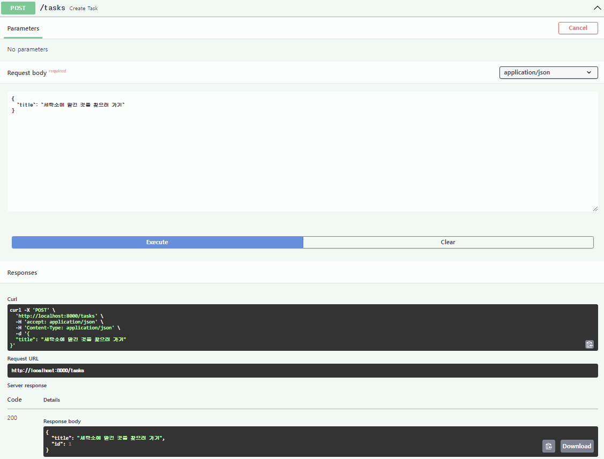
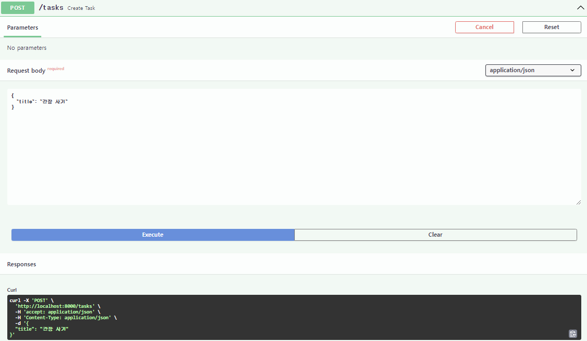

### * 요청의 정의
- 9장에서는 요청 파라미터를 받지않은 GET 함수를 정의했다.
- 이번에는 GET /tasks와 짝을 이루는, POST /tasks에 대응하는 create_task() 함수를 정의해보자

#### 스키마
- 앞서 정의한 GET 함수는 id를 가진 Task 인스턴스를 반환했다.
- 하지만, 일반적으로 POST 함수에서는 id를 지정하지 않고 DB에서 자동으로 id를 매기는 경우가 많다.
- 또한, done 필드에 대해서도 Task 작성 시에는 항상 false이므로 POST /tasks의 엔드포인트에서 제외한다.
- 따라서 POST 함수는 요청 본문으로 title 필드만 받도록 하자
- POST용으로 id, done 필드가 없는 TaskCreate 클래스를 새로 정의한다.
```
# api/schemas/task.py

class TaskCreate(BaseModel):
  title:str | None = Field(None, example="세탁소에 맡긴 것을 찾으러 가기")
```
- 그러면 Task와 TaskCreate의 공통 필드는 title뿐이므로, 양쪽에 title만 가진 베이스 클래스로 TaskBase를 정의하고, Task와 TaskCreate는 이를 이용하도록 고쳐쓴다.
```
# api/schemas/tasky.py

+class TaskBase(BaseModel):
  +title: str | None = Field(None, example="세탁소에 맡긴 것을 찾으러 가기")

-class TaskCreate(BaseModel):
+class TaskCreate(TaskBase):  # TaskBase를 변경하지 않으면 동작 확인 시 title이 표시되지 않는다.
  -  title: str | None = Field(None, example="세탁소에 맡긴 것을 찾으러가기")
  +  pass

-class Task(BaseModel):
+classTask(TaskModel):
   id: int
-  title: str | None = Field(None, example="청소하러 가겠습니다")
   done: bool = Field(False, description="완료 플래그")

+  class Config:
+     orm_mode = true
```
- 여기서 orm_mode는 DB에 접속할 때 사용한다.
- 그리고 TaskCreate의 응답으로, TaskCreate에 id만 추가한 TaskCreateResponse도 정의한다.
```
# api/schemas/task.py

class TaskCreateResponse(TaskCreate):
  id : int


  class Config:
    orm_mode = True
```
- 정리하면, api/schemas/task.py의 클래스 정의 부분은 다음과 같다.
```
# api/schemas/task.py

class TaskBase(BaseModel):
  title: str | None = Field(None, example="세탁소에 맡긴 것을 찾으러 가기")

class TaskCreate(BaseModel):
  pass

class TaskCreateResponse(TaskCreate):
  id: int

  class Config:
    orm_mode = True

class Task(TaskBase):
  id: int
  done: bool = Field(False, description="완료 플래그")

  class Config:
    orm_mode = True
```

#### 라우터
- 라우터에 POST의 경로 동작 함수 create_task()를 정의한다.
```
# api/router/task.py

@router.post("/tasks", response_model=task_schema.TaskCreateResponse)
async def create_task(task_body: task_schema.TaskCreate):
    return task_schema.TaskCreateResponse(id=1, **task_body.dict())
```
- 요청 파라미터에 따라 DB에 저장하고 싶지만, 여기서는 우선 API로 올바른 타입의 데이터를 넘겨받아, 적합한 타입의 응답을 반환하도록 하자.
- 수신한 요청 본문에 id를 부여하여 응답 데이터를 반환하도록 하자
- create_task() 함수의 인수로 지정한 것이 요청 본문 task_body: task_schema.TaskCreate이다.
- 앞서 설명한 바와 같이, 요청에 대한 응답 데이터는 id를 가진다.
- 요청 본문의 task_schema.TaskCreate 클래스를 일단 dict로 변환하고, key/value와 id=1을 가진 task_schema.TaskCreateResponse 인스턴스를 생성하는 것이 task_schema.TaskCreateResponse(id=1, **task_body.dict())이다.
- dict 인스턴스 앞에 **를 붙여 dict를 키워드 인수로 확장하고, task_schema.TaskCreateResponse 클래스의 생성자에 dict의 key/value를 전달한다.
- 즉, task_schema.TaskCreateResponse(id=1, title=task_body.title, done=task_body.done)라고 작성하는 것과 동일하다.

#### 동작확인
- 앞에서 정의한 POST 엔드포인트를 호출해보자
- 요청을 전송하면 요청 본문(Request body)에 id가 부여되어 그대로 응답(Response)으로 돌아오는 것을 확인할 수 있다.

- 요청 본문(Resquest body)을 다음과 같이 변경하면, 동적으로 응답(Responses)이 달라짐을 확인할 수 있다.


### * 나머지 요청과 응답을 모두 정의하기
- 라우터에는 경로 동작 함수가 6개밖에 없으므로, 다른 함수도 요청과 응답을 모두 채워보자
- 최종적으로 api/routers/task.py와 api/routers/done.py의 함수는 아래와 같다.
```
# api/routers/task.py

@router.get("/tasks", response_model=list[task_schema.Task])
async def list_tasks():
    return [task_schema.Task(id=1, title="첫 번째 ToDo 작업")]


@router.post("/tasks", response_model=task_schema.TaskCreateResponse)
async def create_task(task_body: task_schema.TaskCreate):
    return task_schema.TaskCreateResponse(id=1, **task_body.dict())


@router.put("/tasks/{task_id}", response_model=task_schema.TaskCreateResponse)
async def update_task(task_id: int, task_body: task_schema.TaskCreate):
    return task_schema.TaskCreateResponse(id=task_id, **task_body.dict())


@router.delete("/tasks/{task_id}")
async def delete_task(task_id: int):
    return
```
```
# api/routers/done.py

@router.put("/tasks{task_id}/done", response_model=None)
async def mark_task_as_done(task_id: int):
  return


@router.delete("/task(/task_id)/ done", response_model=None)
async def unmark_task_as_done(task_id: int):
  return
```
- done 관련 함수는 체크박스를 ON/OFF할 뿐이므로 요청 본문과 응답이 없어 단순하다.

### * 스키마 기반 개발
- 9장과 10장에서는 8장에서 정의한ㄴ 라우터의 플레이스홀더에 대해 요청과 응답을 정의했다.
- 하지만 핵심적인 데이터 저장과 데이터 읽기가 아직 구현되어 있지 않아 API로서는 그다지 도움이 되지 않는다.
- 라우터로서는 각 경로 연산에 3줄의 코드만 작성했을 뿐이지만, API Mock(모의 객체) 역할을 수행한다.
- 여기까지 준비된 단계에서 프론트엔드와 백엔드 통합을 시작할 수 있다.
- 이후의 구현에서는 이러한 요청과 응답의 정의에 대해 언급하지 않는다.
- 물론 조건에 따라 요청과 응답의 형태가 달라지거나 비정상적인 경우를 모두 처리하지 못할 수도 있다.
- 하지만 적어도 정상 케이스의 한 패턴에 대해 모든 엔드포인트를 커버하고 있다는 것은 1장 FastAPI 개요에서도 설명했듯이 API 개발과 분리된 SPA 개발 등에서, 프론트엔드 개발자에게 강력한 무기가 될 것이다.

#### 개발 초기에 미치는 영향
- 많은 Web API 프레임워크는 Swagger UI의 통합을 지원하지 않는다. 그렇기 때문에 보통은 아래와 같이 세 단계로 스키마 개발을 실현한다.
```
1. 스키마를 OpenAPI 형식(일반적으로 YAML)으로 정의한다.
2. Swagger UI를 제공하여 프론트엔드 개발자에게 전달한다.
3. API 개발에 착수한다.
```
- 그러나 FastAPI에서는 다음과 같이 훨씬 간단한 단계로 스키마 기반 개발을 실현할 수 있다.
```
1. APi 개발 과정으로 라우터와 스키마를 정의하고, 자동 생성된 Swagger UI를 프론트엔드 개발자에게 전달한다.
2. 위 라우터와 스키마에 살을 붙이는 형태로 API의 기능을 구현한다.
```

#### 기능 수정 시 미치는 영향
- FastAPI를 통한 스키마 기반 개발은 생각보다 강력하다.
- 처음 개발할 때뿐만 아니라 처음 정의한 요청과 응답을 수정하는 흐름을 생각해보자
- 보통 다른 프레임워크에서는 아래와 같이 개발한다.
```
1. 먼저 OpenAPI로 정의한 스키마를 변경한다.
2. 변경된 Swagger UI를 제공하여 프론트엔드 개발자에게 전달한다.
3. API를 수정한다.
```
- 반면에 FastAPI라면 동작 중인 API의 요청과 응답을 직접 변경하고, 동시에 자동 생성된 Swagger UI를 프론트엔드 개발자에게 전달하는 것으로 끝이다.
- 한 번 API를 개발해 놓으면 OpenAPI의 스키마 정의는 유지관리되지 않게 되며, Swagger UI를 제공하는 모의 서버를 구동하는 방법을 잊어버리거나 아예 망가져 버리는 경우가 발생하기도 한다.
- 하지만 FastAPI는 API 인터페이스의 정의(문서)와 구현이 함께 제공되므로 그런 걱정이 없다.