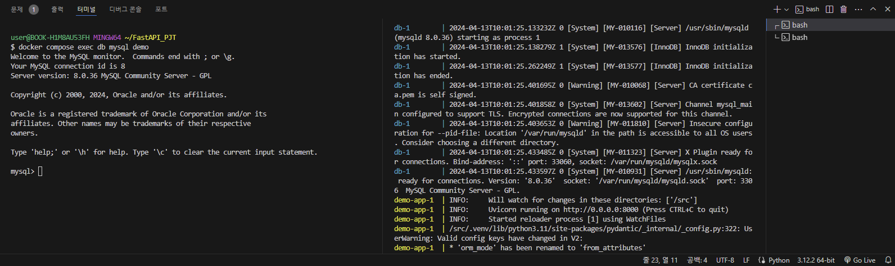
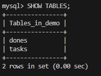
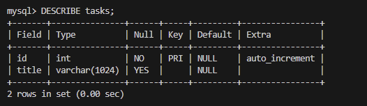
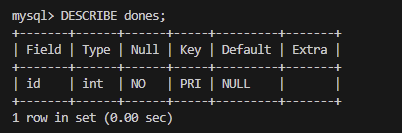

### MySQL 컨테이너 실행
- 3장에서 설명했듯이 docker compose를 이용하면 MySQL도 쉽게 설치할 수 있다.
- 데이터베이스 서버는 다양한 종류가 있지만, 여기서는 프로덕션 환경에서 가장 많이 사용되는 데이터베이스 서버 중 하나인 MySQL을 사용하기로 하자
- 로컬에 MySQL이 설치되어 있다면 그쪽을 사용해도 상관없지만, ToDO 앱의 컨테이너와 연결하거나 로컬 MySQL의 데이터를 오염시키지 않고 사용할 수 있기 때문에 컨테이너를 만들어 실행하자
```
SQLite란?
: 공식 문서나 튜토리얼 등에서는 MySQL 대신 파일 기반으로 쉽게 사용할 수 있는 SQLite를 데이터베이스로 소개하는 경우가 많다.
  하지만 SQLite는 기본적인 SQL문은 지원하지만 데이터 타입의 종류가 적고, 애초에 파일 기반이라 확장(scalability)을 위한 분산 구성이 어려운 점 등, 향후 프로젝트가 커졌을 때 부딪히는 문제가 많으므로 현실적인 웹 애플리케이션의 데이터베이스로 채택된 사례는 많지 않다.
  이후 14장에서는 SQLite를 사용하지만, 프로덕션 코드(테스트 코드가 아닌 코드)에서는 좀 더실용적인 앱 개발을 목표로 하여, 그대로 실제 서비스로 확장할 수 있도록 MySQL을 사용한다.
```
- demo-app과 함께 demo라는 이름의 데이터베이스를 가진 db 서비스를 추가한다.
```
# docker-compose.yaml

version: '3'
services:
  demo-app:
    build: .
    volumes:
      - .dockervenv:/src/.venv
      - .:/src
    ports:
      - 8000:8000  # 호스트 머신의 8000번 포트를 docker의 8000번 포트에 연결.
    environment:
      - WATCHFILES_FORCE_POLLING=true  # 환경에 따라 핫 리로드를 위해 필요함
  db:
    image: mysql:8.0
    platform: linux/x86_64  # 애플 실리콘 맥(M1/M2 등)의 경우 필요
    environment:
      MYSQL_ALLOW_EMPTY_PASSWORD: 'yes'  # root 계정을 비밀번호 없이 생성
      MYSQL_DATABASE: 'demo'  # demo 데이터베이스를 초기 데이터베이스로 설정
      TZ: 'Asia/Seoul'  # 시간대를 한국 시간으로 설정
    volumes:
      - mysql_data:/var/lib/mysql
    command: --default-authentication-plugin=mysql_native_password  # MySQL8.0에서는 기본값이 "caching_sha2_password"이라 드라이버가 비지원이므로 변경
    ports:
      - 33306:3306  # 호스트 머신의 33306번 포트를 docker의 3306번 포트에 연결
volumes:
  mysql_data:
```
- 이미 docker compose up으로 FastAPI가 실행된 상태라면, 중지하여 다시 docker compose up을 실행한다.
```
$ docker compose up
```
- ToDo 앱과 MySQL이 아래와 같이 동시에 실행될 것이다.
```
db-1        | 2024-04-13 19:01:24+09:00 [Note] [Entrypoint]: Entrypoint script for MySQL Server 8.0.36-1.el8 started.
db-1        | 2024-04-13 19:01:24+09:00 [Note] [Entrypoint]: Switching to dedicated user 'mysql'
db-1        | 2024-04-13 19:01:24+09:00 [Note] [Entrypoint]: Entrypoint script for MySQL Server 8.0.36-1.el8 started.
db-1        | '/var/lib/mysql/mysql.sock' -> '/var/run/mysqld/mysqld.sock'
db-1        | 2024-04-13T10:01:25.131641Z 0 [Warning] [MY-011068] [Server] The syntax '--skip-host-cache' is deprecated and will be removed in a future release. Please use SET GLOBAL host_cache_size=0 instead.
db-1        | 2024-04-13T10:01:25.133213Z 0 [Warning] [MY-010918] [Server] 'default_authentication_plugin' is deprecated and will be removed in a future release. Please use authentication_policy instead.
db-1        | 2024-04-13T10:01:25.133232Z 0 [System] [MY-010116] [Server] /usr/sbin/mysqld (mysqld 8.0.36) starting as process 1
db-1        | 2024-04-13T10:01:25.138279Z 1 [System] [MY-013576] [InnoDB] InnoDB initialization has started.
db-1        | 2024-04-13T10:01:25.262249Z 1 [System] [MY-013577] [InnoDB] InnoDB initialization has ended.
db-1        | 2024-04-13T10:01:25.401695Z 0 [Warning] [MY-010068] [Server] CA certificate ca.pem is self signed.
db-1        | 2024-04-13T10:01:25.401858Z 0 [System] [MY-013602] [Server] Channel mysql_main configured to support TLS. Encrypted connections are now supported for this channel.
db-1        | 2024-04-13T10:01:25.403653Z 0 [Warning] [MY-011810] [Server] Insecure configuration for --pid-file: Location '/var/run/mysqld' in the path is accessible to all OS users. Consider choosing a different directory.
db-1        | 2024-04-13T10:01:25.433485Z 0 [System] [MY-011323] [Server] X Plugin ready for connections. Bind-address: '::' port: 33060, socket: /var/run/mysqld/mysqlx.sock
db-1        | 2024-04-13T10:01:25.433597Z 0 [System] [MY-010931] [Server] /usr/sbin/mysqld: ready for connections. Version: '8.0.36'  socket: '/var/run/mysqld/mysqld.sock'  port: 3306  MySQL Community Server - GPL.
```
- 컨테이너 내 MySQL 데이터베이스에 접근할 수 있는지 확인해보자
- docker compose up이 실행된 상태에서 다른 터미널을 열고, 프로젝트 디렉터리에서 docker compose exec db bysql demo를 실행한다.
- 아래처럼 MySQL 클라이언트가 실행되고, DB에 접속된 것을 확인할 수 있다.
```
# "db" 컨테이너 안에서 "mysql demo" 명령어를 실행
$ docker compose exec db mysql demo
```

```
Welcome to the MySQL monitor.  Commands end with ; or \g.
Your MySQL connection id is 8
Server version: 8.0.36 MySQL Community Server - GPL

Copyright (c) 2000, 2024, Oracle and/or its affiliates.

Oracle is a registered trademark of Oracle Corporation and/or its
affiliates. Other names may be trademarks of their respective
owners.

Type 'help;' or '\h' for help. Type '\c' to clear the current input statement.

mysql> 
```

### * 앱에서 DB에 접속하기 위한 준비
#### MySQL 클라이언트 설치
- FastAPI에서는 MySQL과의 연결을 위해 sqlalchemy라는 ORM(Object-Relational Mapper)라이브러리를 사용한다.
- ORM은 객체지향 프로그래밍과 데이터베이스 간의 연결을 쉽게 해 주는 기술이다.
- 이를 통해 데이터베이스의 데이터를 객체로 다루고, 객체를 데이터베이스에 저장하거나 조회할 수 있다.
- sqlalchemy는 파이썬에서는 상당히 대중적인 라이브러리로, Flask 등 다른 웹 프레임워크에서도 사용된다.
```
ORM이란?
: ORM은 파이썬 객체를 MySQL과 같은 관계형 데이터베이스(RDBMS)의 데이터 구조로 변환합니다.
  MySQL의 경우 테이블 구조를 클래스로 정의하면 이를 읽거나 저장하는 SQL문을 발행해준다.
  FastAPI에서는Peewee라는 ORM도 지원한다.
  자세한 내용은 공식 문서(https://fastapi.tiangolo.com/how-to/sql-database-peewee/)를 참고하자
```
- sqlalchemy는 백엔드에 다양한 데이터베이스를 이용할 수 있다.
- 이번에는 MySQL 클라이언트로 pymysql도 함께 설치한다.
- 5장과 마찬가지로 demo-app이 실행된 상태에서 poetry add를 실행하여 두 의존성 패키지를 설치한다.
```
# "demo-app" 컨테이너에서 "poetry add sqlalchemy pymysql"을 실행
$ docker compose up exec demo-app poetry add sqlalchemy pymysql
```
- 설치하면 pyproject.tom과 poetry.lock의 내용이 변경된 것을 확인할 수 있다.
```
[tool.poetry.dependencies]
python = "^3.11"
fastapi = "^0.110.1"
uvicorn = {extras = ["standard"], version = "^0.29.0"}
sqlalchemy = "^2.0.29"
pymysql = "^1.1.0"
```

#### DB 연결 함수
- 프로젝트 루트에 아래와 같이 api/db.py를 추가한다.
```
# api/db.py

from sqlalchemy.ext.asyncio import create_engine
from sqlalchemy.orm import sessionmaker, declarative_base

DB_URL = "mysql+pymysql://root@db:3306/demo?charset=utf8"

db_engine = create_engine(DB_URL, echo=True)
db_session = sessionmaker(autocommit=False, autoflush=False, bind=db_engine)


Base = declarative_base()


def get_db():
    with db_session() as session:
        yield session
```
- DB_URL에 정의한 MySQL의 Docker 컨테이너에 접속할 세션을 생성하고 있다.
- 라우터에서는 get_db() 함수로 이 세션을 가져와 DB에 접근할 수 있도록 한다.

### * SQLAlchemy의 DB 모델 정의
- ToDo 앱을 위해 아래 두개의 테이블을 정의한다.
```
# tasks 테이블 정의

컬럼명  Type             비고
id      INT             primary, auto increment
title   VARCHAR(1024)
```
```
# dones 테이블 정의

컬럼명  Type             비고
id      INT             primary, auto increment, foreign(task.id)
```
- Tasks의 레코드는 작업 하나하나에 대응하며, dones는 Tasks 중 완료된 작업만 해당 Task와 동일한 id의 레코드를 가진다.
- 여기서 Tasks의 id와 dones의 id는 1:1 매핑(mapping)(1:1 대응)으로 설정되어 있다.
- 보통 1:1 매핑의 경우 정규화 측면에서 하나의 테이블로 하는 경우가 많지만, 여기서는 Task와 done의 리소스를 명확하게 분리하여, 이해하기 쉽도록 별도의 테이블로 정의한다.
- 아래와 같이 api/models/task.py를 작성한다.
```
# api/models/task.py

from sqlalchemy import Column, Integer, String, ForeignKey
from sqlalchemy.orm import relationship

from api.db import Base


class Task(Base):
    __tablename__ = "tasks"

    id = Column(Integer, primary_key=True)
    title = Column(String(1024))

    done = relationship("Done", back_populates="task", cascade="delete")


class Done(Base):
    __tablename__ = "dones"

    id = Column(Integer, ForeignKey("tasks.id"), primary_key=True)

    task = relationship("Task", back_populates="done")
```
- Column은 테이블의 각 컬럼을 나타낸다.
- 첫 번째 인수에는 컬럼의 타입을 전달한다.
- 그리고 두번째 인수에는 이후에 컬럼의 설정을 작성한다.
- 위의 primary_key=True나 ForeignKey("tasks.id") 외에도, Null 제약 조건(nullable=False), Unique 제약 조건(unique=True) 등을 지원한다.
- relationship은 테이블(모델 클래스) 간의 관계를 정의한다.
- 이를 통해 Task 객체에서 Done 객체를 참조하거나 그 반대도 가능해진다.
- cascade="delete"를 지정하면 12장에서 구현하는 DELETE /tasks/{task_id} 인터페이스에서 Task를 삭제할 때, 외부 키에 지정된 동일한 id의 done이 있으면 자동으로 삭제한다.

#### DB 마이그레이션
- 작성한 ORM 모델을 바탕으로 DB 테이블을 생성하고, DB 마이그레이션(이관)용 스크립트를 작성한다.
```
# api/migrate_db.py

from sqlalchemy import create_engine

from api.models.task import Base

DB_URL = "mysql+pymysql://root@db:3306/demo?charset=utf8"
engine = create_engine(DB_URL, echo=True)


def reset_database():
    Base.metadata.drop_all(bind=engine)
    Base.metadata.create_all(bind=engine)


if __name__ == "__main__":
    reset_database()
```
- 다음처럼 스크립트를 실행하여 Docker 컨테이너의 MySQL에 테이블을 작성한다.
- 이미 같은 이름의 테이블이 있는 경우 삭제한 후 재작성된다.
```
# api 모듈의 migrate_db 스크립트를 실행
$ dockerr compose exec demo-app poetry run python -m api.migrate_db
```
```
2024-04-13 10:46:22,702 INFO sqlalchemy.engine.Engine SELECT DATABASE()
2024-04-13 10:46:22,702 INFO sqlalchemy.engine.Engine [raw sql] {}
2024-04-13 10:46:22,703 INFO sqlalchemy.engine.Engine SELECT @@sql_mode
2024-04-13 10:46:22,703 INFO sqlalchemy.engine.Engine [raw sql] {}
2024-04-13 10:46:22,704 INFO sqlalchemy.engine.Engine SELECT @@lower_case_table_names      
2024-04-13 10:46:22,704 INFO sqlalchemy.engine.Engine [raw sql] {}
2024-04-13 10:46:22,705 INFO sqlalchemy.engine.Engine BEGIN (implicit)
2024-04-13 10:46:22,705 INFO sqlalchemy.engine.Engine DESCRIBE `demo`.`tasks`
2024-04-13 10:46:22,705 INFO sqlalchemy.engine.Engine [raw sql] {}
2024-04-13 10:46:22,706 INFO sqlalchemy.engine.Engine DESCRIBE `demo`.`dones`
2024-04-13 10:46:22,706 INFO sqlalchemy.engine.Engine [raw sql] {}
2024-04-13 10:46:22,707 INFO sqlalchemy.engine.Engine COMMIT
2024-04-13 10:46:22,708 INFO sqlalchemy.engine.Engine BEGIN (implicit)
2024-04-13 10:46:22,708 INFO sqlalchemy.engine.Engine DESCRIBE `demo`.`tasks`
2024-04-13 10:46:22,708 INFO sqlalchemy.engine.Engine [raw sql] {}
2024-04-13 10:46:22,709 INFO sqlalchemy.engine.Engine DESCRIBE `demo`.`dones`
2024-04-13 10:46:22,709 INFO sqlalchemy.engine.Engine [raw sql] {}
2024-04-13 10:46:22,710 INFO sqlalchemy.engine.Engine
CREATE TABLE tasks (
        id INTEGER NOT NULL AUTO_INCREMENT,
        title VARCHAR(1024),
        PRIMARY KEY (id)
)


2024-04-13 10:46:22,710 INFO sqlalchemy.engine.Engine [no key 0.00013s] {}
2024-04-13 10:46:22,721 INFO sqlalchemy.engine.Engine
CREATE TABLE dones (
        id INTEGER NOT NULL,
        PRIMARY KEY (id),
        FOREIGN KEY(id) REFERENCES tasks (id)
)


2024-04-13 10:46:22,721 INFO sqlalchemy.engine.Engine [no key 0.00012s] {}
2024-04-13 10:46:22,733 INFO sqlalchemy.engine.Engine COMMIT
```
- 이것으로 DB에 테이블이 생성되었다.

#### 확인
- 실제로 테이블이 생성되었는지 확인해보자
- docker compose up으로 컨테이너가 실행된 상태에서 MySQL 클라이언트를 실행한다.
```
$ docker compose exec db mysql demo
```
- 아래처럼 SQL문을 입력하여 DB 내용을 확인한다.



- 다음 장에서는 DB의 쓰기와 읽기 처리를 작성하고, API와 연결해보자