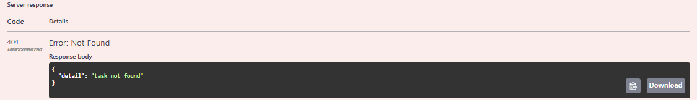
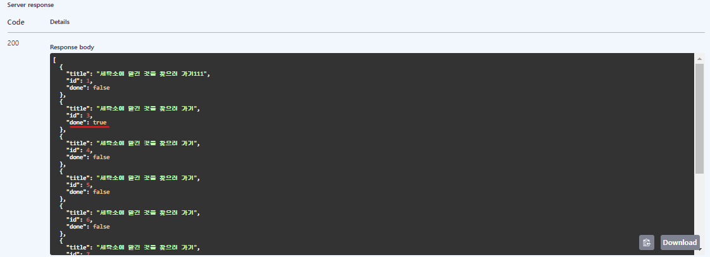

### * C: Create
- 처음에는 데이터가 존재하지 않으므로 POST / tasks부터 작성한다.
#### CRUDs
- 라우터는 MVC(Model , View, Controller)의 컨트롤러에 해당한다.
- Rails 등 MVC 프레임워크에 익숙한 사람이라면 익숙하겠지만, 컨트롤러는 모델이나 뷰를 연결하기 때문에 비대해지기 쉽다. (Fat Controller)
- 이를 피하기 위해 CRUD 조작 처리는 api/cruds/task.py에 작성한다.
```
from sqlalchemy.orm import Session


import api.models.task as task_model
import api.schemas.task as task_schema


def create_task(db: Session, task_create: task_schema.TaskCreate) -> task_model.Task:     --- (1)
  task = task_model.Task(**task_create.dict())      --- (2)
  db.add(task)
  db.commit()     --- (3)
  db.refresh(task)      --- (4)
  return task     --- (5)
```
- 작업의 흐름을 차레대로 적어보자
1. 스키마 task_create: task_schema.TaskCreate를 인수로 받는다.
2. 이를 DB 모델인 task_model.Taks로 변환한다.
3. DB에 커밋한다.
4. DB의 데이터를 바탕으로 Task 인스턴스인 task를 업데이트 한다.(작성된 레코드의 ID를 가져옴)
5. 생성한 DB 모델을 반환한다.

#### 라우터
- 앞에서 소개한 CRUD 정의를 이용하는 라우터는 아래와 같이 다시 작성할 수 있다.
```
# api/router/task.py

-from fastapi import APIRouter
+from fastapi import APIRouter, Depends
+from sqlalchemy.orm import Session


+import api.cruds.task as task_crud
+from api.db import get_db
```
```
# api/routers/task.py

@router.post("/task", response_model=task-schema.TaskCreateResponse)
-async def create_tas(task_body: task_schema.TaskCreate):
+async def create_task(task_body: task-schema.TaskCreate, db: Session = Depends(get_db)):
-   return task_schema.TaskCreateResponse(id=1, *8task_body.dict())
+   return task_crud.create_task(db, task_body)
```

#### DB 모델과 응답 스키마 변환하기
- 요청 본문의 task_schema.TaskCreate와 응답 모델의 task_schema.TaskCreateResponse에 대해서는 9장에서 설명한 것과 같이, 요청에 대해 id만 부여하여 반환해야 한다.
```
# api/schemas/task.py

class Taskvase(BaseModel):
  title: str | None = Field(None, example="세탁소에 맡긴 것을 찾으러 가기")


class TaskCreate(TaskBase):
  pass


class TaskCreateResponse(TaskCreate):
  id: int


  class Config:
    orm_mode = True
```
- 여기서 orm_mode = True는 응답 스키마 TaskCreate Response가 암묵적으로 ORM에서 DB 모델의 객체를 받아들여, 응답 스키마로 변환한다는 것을 의미한다.
- 그 증거로, 앞서 task_crud.create_task(db, task_body)는 DB 모델의 task_model.Task를 반환하고 있지만, 동작 결과가 변하지 않는 것으로 보아 API가 올바르게 TaskCreateResponse로 변환하고 있을을 알 수 있다.
- 이는 내부적으로 TaskCreateResponse를 task.model.Task의 각 필드를 사용하여 초기화하여 구현하고 있다.

#### 의존성 주입(DI)
- 위에서 등장하는 생소한 db: Session = Depends(get_db) 코드에 주목하자
- Depends는 함수를 인수로 받아 의존성 주입(Dependency Injection, DI)을 수행하는 메커니즘이다.
- 의존성 주입은 객체가 직접 서비스를 찾거나 생성하는 대신, 외부로부터 필요한 서비스를 받아와 사용하는 소프트웨어 디자인 기법이다.
- 객체는 해당 서비스를 외부에서 주입받아 사용하며, 이는 유연하고 재사용 가능한 코드를 작성하는 데 도움을 준다.
- 또한, get_db는 11장에서 정의한 DB 세션을 가져오는 함수이다.
- DB 접속 부분에 의존성 주입을 이용하여 비즈니스 로직과 DB가 밀접하게 결합되어 버리는 것을 방지할 수 있다.
- 또한, 의존성 주입을 통해 db 인스턴스의 내용을 외부에서 오버라이드 할 수 있으므로, 테스트 수행 시 get_db와 다른 연결 대상으로 교체하는 등의 작업이 프로덕션 코드를 수정하지 않아도 가능해진다.

#### 동작확인
- Swagger Ui에서 POST / tasks 엔드포인트에 접속해보자.
- 'Execute'를 클릭할 때마다 id 값이 증가한 결과를 반환하는 것을 확인할 수 있다.


### * R: Read
- 앞 절의 C(Create)를 통해 Task를 작성할 수 있게 되었으므로, 다음으로 Task를 리스트로 받아오는 Read 엔드포인트를 생성하자
- ToDo 앱에는 Task에 대해 Done 모델이 정의되어 있는데, Read를 통해 각각을 개별적으로 가져오는 것은 번거롭다.
- 이들을 조인(join)하여 ToDo 작업에 Done 플래그가 부여된 상태의 리스트를 가져오는 엔드포인트를 만들어 보자.

#### Cruds
- join하므로 CRUD 정의가 조금 복잡해진다.
```
# api/cruds/task.py

from sqlalchemy import select
from sqlalchemy.engine import Result


def get_tasks_with_done(db: Session) -> list[tuple[int, str, bool]]:
  result: Result = db.execute(    --- (1)
    select(     --- (3)
      task_model.Task.id,
      task_model.Task.title,
      task_model.Done.id.isnot(None).label("done"),     --- (4)
    ).outerjoin(task_model.Done)      --- (3)


  )
  return result.all()     --- (2)
```
1. 사실 이 Result 인스턴스는 아직 DB 요청의 결과 전체를 가지고 있지 않다. DB 레코드를 처리할 때 for 반복문 등으로 효율적으로 결과를 가져오기 위해 이터레이터(iterator)로 정의되어 있다.
2. 이번에는 반복문으로 다룰 만큼 무거운 처리가 없으므로 result.all() 호출로 모든 DB 레코드를 가져온다.
3. select()로 필요한 필드르 지정하고, .outerjoin()으로 메인 DB 모델에 조인할 모델을 지정한다. 또한, dones 테이블은 Tasks 테이블과 동일한 ID를 가지며, ToDo 작업이 완료되었을 때만 레코드가 존재한다고 설명했다.
4. task_model.Done.id.isnot(None).label("done")에 의해 Done.id가 존재하면 done=True로, 존재하지 않으면 done=False로 조인한 레코드를 반환한다.
```
SQLAlchemy 2.0
: 많은 인터페이스가 변경되었지만, 가장 큰 변화로 session.query()가 아닌 session.execute() 안에 select()를 사용하여 쿼리를 더욱 명시적으로 작성하는 것이 최신의 작성 방식이라고 한다.

# 1.x에서 작성하는 방법
    session.query(User).all()
# 2.0에서 작성하는 방법
    session.execute(select(User)).scalars().all()

참고로 2.0 릴리스 시점에 session.query() 작성법 자체가 불가능해진 것은 아니며, 레거시한 작성법으로써 남아있다.
```

#### 라우터
- 앞에서 작성한 CRUD 정의를 이용하는 라우터는, 12장 Create와 거의 동일하게 구현한다.
```
# api/routers/task.py

@router.get("/tasks", response_model=list[task_schema.Task])
async def list_tasks(db: Session = Depends(get_db)):
  return task_crud.get_tasks_with_done(db)
```

#### 동작확인
- Create를 실행한 횟수만큼 ToDo 작업이 생성되고 있으며, 전체가 리스트로 반환된다.
- 또한, Tasks 테이블의 내용 뿐만 아니라 각 ToDo 작업의 완료 플래그인 done이 부여되어 있는 것을 알 수 있다.
- 아직 done 리소스의 엔드포인트를 정의하지 않았기 때문에 현재로서는 모두 false이다.


### * U: Update
- Update도 Create와 거의 비슷하지만, 존재하는 Task에 대한 요청인지 여부를 확인하여, 존재하면 업데이트 하고, 존재하지 않으면 404 오류를 반환하는 API로 만든다.

#### CRUDs
- 아래 두 함수를 정의한다.
```
# api/cruds/task.py

def get_task(db: Session, task_id: int) -> task_model.Task | None:
  result: Result = db.execute(
    select(task_model.Task).filter(task_model.Task.id == task_id)
  )
  return result.scalars().first()


def update_task(
  db: Session, task_create: task_schema.TaskCreate, original:task_model.Task) -> task_model.Task:
    original.title = task_create.title
    db.add(original)
    db.commit()
    db.refresh(original)
    return original
```
- get_task() 함수에서는 .filter() 메서드를 사용하여 SELECT~WHERE의 SQL 쿼리에 의해 대상을 좁혀주고 있다.
- 또한, Result는 select()에서 지정한 요소가 하나라도 튜플(tuple)로 반환되므로, 튜플이 아닌 값으로 가져오는 과정이 별도로 필요하다.
- scalars() 메서드를 이용하면 결과의 각 행에서 가져올 요소를 1개로 좁혀서 값을 가져올 수 있다.
```
튜플(Tuple)
: 파이썬에서 튜플은 변경할 수 없는(immutable) 시퀀스 자료형이다. 여러 요소들을 괄호 안에 쉼표로 구분하여 나열한 것이며, 인덱스를 통해 각 요소에 접근할 수 있다. 튜플은 한 번 생성되면 요소를 추가, 삭제, 수정할 수 없지만, 여러 값을 묶어서 사용하고자 할 때 유용하다. .append() 등 값을 변경하는 메소드는 사용할 수 없고, 조회를 하는 .count(), .index() 메소드만 사용할 수 있다.
```

#### 라우터
- 앞에서 작성한 CRUD 정의를 이용하는 라우터는 아래와 같이 구현한다.
```
# api/routers/task.py

from fastapi import APIRouter, Depends, HTTPException


@router.put("/tasks/{task_id}", response_model=task_schema.TaskCreateResponse)
async def update_task(
  task_id: int, task_body: task_schema.TaskCreate, db: Session = Depends(get_db)
):
  task = task_crud.get_task(db, task_id=task_id)
  if task is None:
    raise HTTPException(status_code=404, detail="Task not found")

  
  return task_crud.update_task(db, task_body, original=task)
```
- 여기서 HTTPException은 임의의 HTTP 상태 코드를 인수로 받을 수 있는 Exception 클래스이다.
- 이번에는 404 Not Found를 지정하여 raise한다.
- raise 문은 파이썬에서 예외를 명시적으로 발생시키는 데 사용된다.
- 예외는 프로그램 실행 중에 오류나 예상치 못한 상황을 나타내며, raise 문을 통해 개발자가 직접 원하는 시점에 예외를 발생시켜 예외 처리를 수행할 수 있다.


- 앞에서 정의한 Read 인터페이스를 싱행하면 변경된 결과를 확인할 수 있다.


### * D: Delete

#### CRUDs
- Delete의 인터페이스도 Update와 거의 비슷하다.
- 먼저 get_task()함수를 실행한 후 delete_task()함수를 실행한다.
```
# api/cruds/task.py

def delete_task(db: Session, original: task_model.Task)-> None:
  db.delete(original)
  db.commit()
```

#### 라우터
- 앞에서 작성한 CRUD 정의를 이용하는 라우터는 아래와 같이 구현한다.
```
# api/routers/task.py


@router.delete("/tasks/{task_id}", response_model=None)
async def delete_task(task_id: int, db: Session = Depends(get_db)):
  task = task_crud.get_task(db, task_id=task_id)
  if task is None:
    raise HTTPException(status_code=404, detail="task not found")

  
  return task_crud.delete_task(db, original=task)
```


- 다시 실행하면 이미 삭제되었기 때문에 404 오류가 반환된다.



- Read 인터페이스를 실행하면 삭제가 완료되었음을 확인할 수 있다.


### * Done 리소스
- Task 리소스와 마찬가지로 Done 리소스도 정의해보자
- CRUD와 라우터를 동시에 살펴보면
```
# api/cruds/done.py

from sqlalchemy import select
from sqlalchemy.engine import Result
from sqlalchemy.orm import Session


import api.models.task as task_model


def get_done(db: Session, task_id: int) -> task_model.Done | None:
  result: Result = db.execute(
    select(task_model.Done).filter(task_model.Done.id == task_id)
  )
  return result.scalars().first()


def create_done(db: Session, task_id: int) -> task_model.Done:
  done = task_model.Done(id=task_id)
  db.add(done)
  db.commit()
  db.refresh(done)
  return done


def delete_done(db: Session, original: task_model.Done) -> None:
  db.delete(original)
  db.commit()
```
```
# api/routers/done.py

from fastapi import APIRouter, HTTPException, Depends
from sqlalchemy.orm import Session


import api.schemas.done as done_schema
import api.cruds.done as done_crud
from api.db import get_db


router = APIRouter()


@router.put("/task/{task_id}/done", response_model=done_schema.DoneResponse)
async def mark_task_as_done(task_id: int, db: Session = Depends(get_db)):
  done = done_crud.get_done(db, task_id=task_id)
  if done is not None:
    raise HTTPException(status_code=400, detail="Done already exists")

  
  return done_crud.create_done(db, task_id)


@router.delete("/tasks/{task_id}/done", response_model=None)
async def unmark_task_as_done(task_id: int, db: Session=Depends(get_db)):
  done = done_crud.get_done(db, task_id=task_id)
  if done is None:
    raise HTTPExceptions(status_code=404, detail="Done not found")

  
  return done_crudd.delete_done(db, original=done)
```
- 응답 스키마가 필요하므로 api/schemas/done.py도 함께 생성해준다.
```
# api/schemas/done.py

from pydantic import BaseModel


class DoneResponse(BaseModel):
  id: int


  class Config:
    orm_mode = True
```
- 조건에 따라 다음 동작을 하므로 주의해야 한다.
  - 완료 플래그가 설정되어 있지 않은 경우
    - PUT : 완료 플래그가 설정됨
    - DELETE : 플래그가 없으므로 404 오류를 반환
  - 완료 플래그가 설정되어 있는 경우
    - PUT : 이미 플래그가 설정되어 있으므로 400 오류를 반환
    - DELETE : 완료 플래그를 지움

#### 동작확인
- Done 리소스의 Update 인터페이스에서 존재하는 작업(Task)의 task_id를 입력해 실행한 뒤, Task 리소스의 Read 인터페이스를 실행하면 done 플래그가 변경된 것을 확인할 수 있다.




### * 최종 디렉터리 구성
- ToDo 앱이 동작하는 데 필요한 파일 모드를 정의했다.
- 최종적으로 아래와 같이 파일 구성이 되어 있을 것이다.
```
■ api
└ __int__.py
└ db.py
└ main.py
└ migrate_db.py
└ ■ cruds
  └ __init__.py
  └ done.py
  └ task.py
└ ■ models
  └ __init__.py
  └ task.py
└ ■ routers
  └ __init__.py
  └ done.py
  └ task.py
└ ■ schemas
  └ __init_-.py
  └ done.py
  └ task.py
```
- Swagger UI에서 모든 동작을 확인할 수 있다.
- 이대로도 문제없이 동작하지만, 다음 장에서는 FastAPI를 좀 더 빠르게 만들기 위해 지금까지 작성한 처리를 비동기화할 것이다.
- 또한, 14장에서는 Swageer UI에서 동작을 확인하지 않아도 소스 코드 변경 시 버그를 조기에 발견할 수 있도록 유닛 테스트를 작성할 것이다.